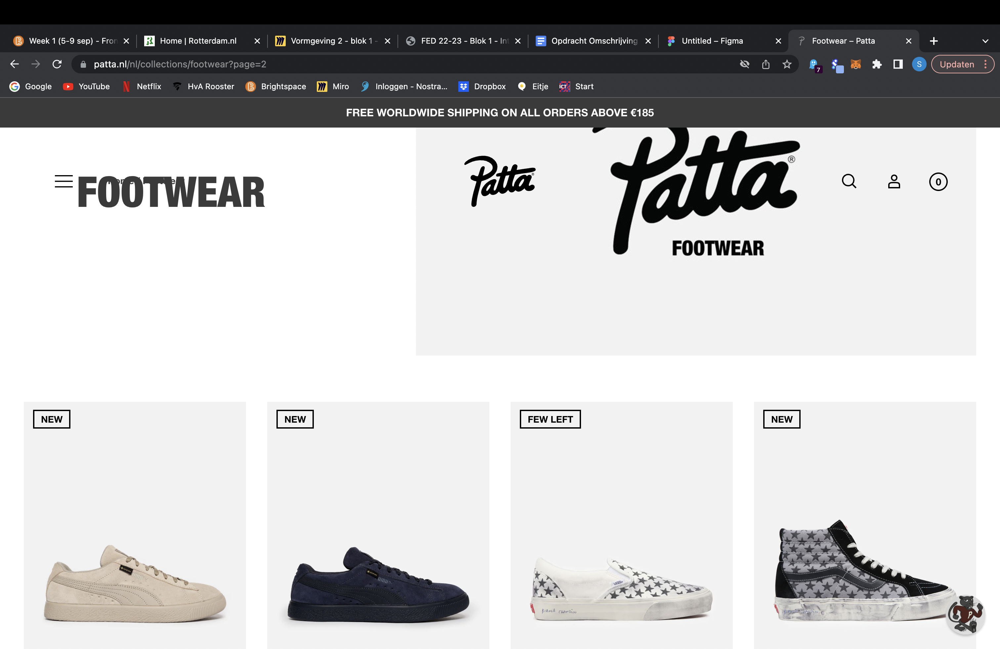
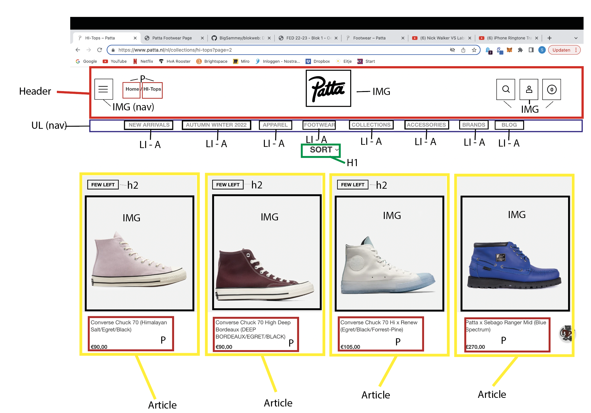
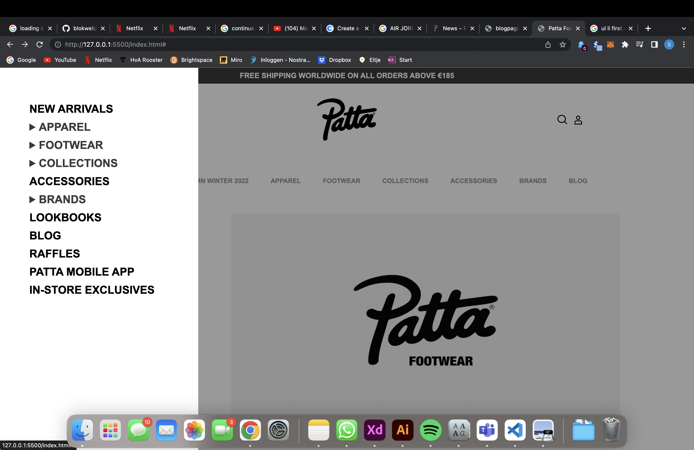
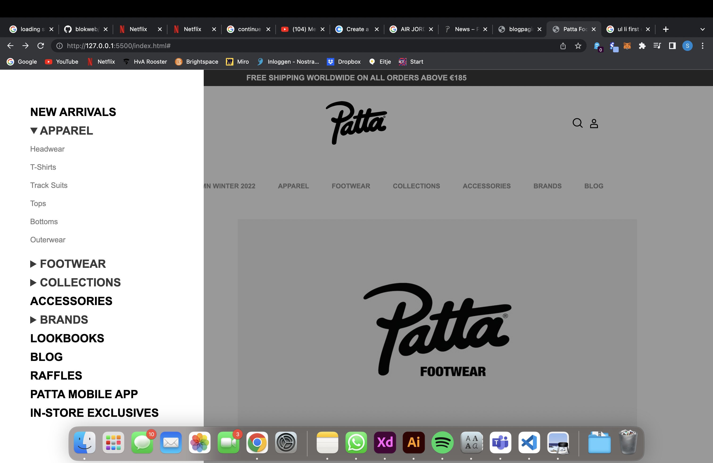
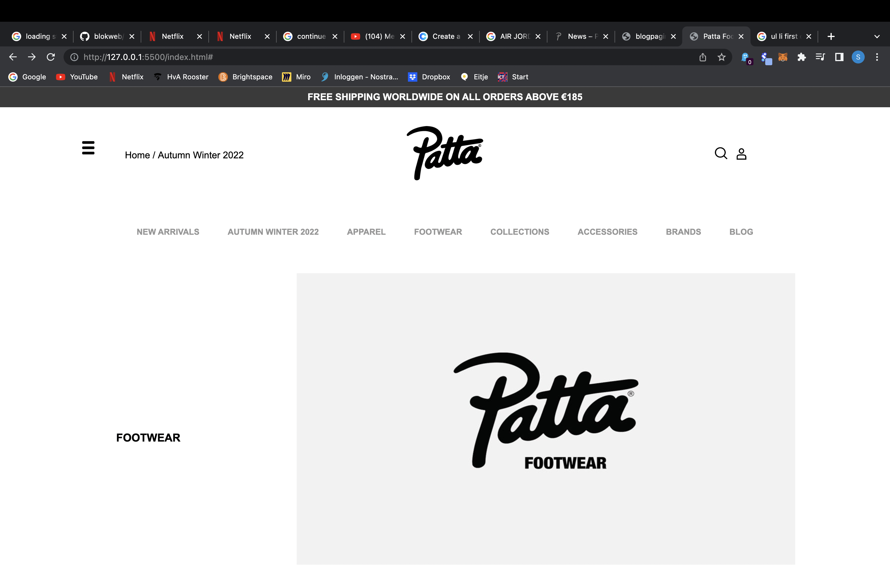
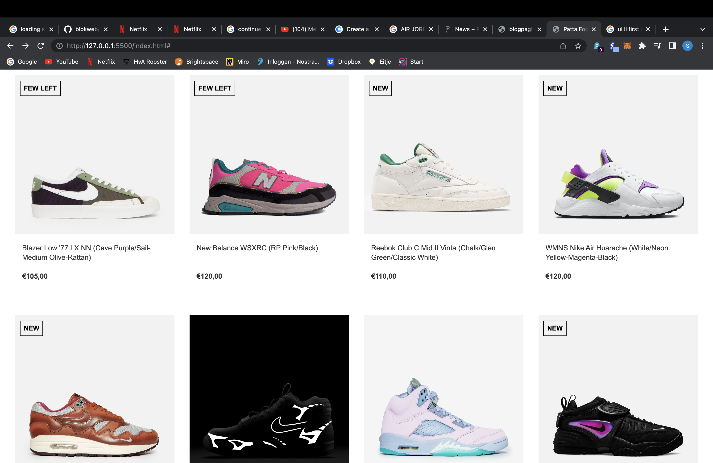
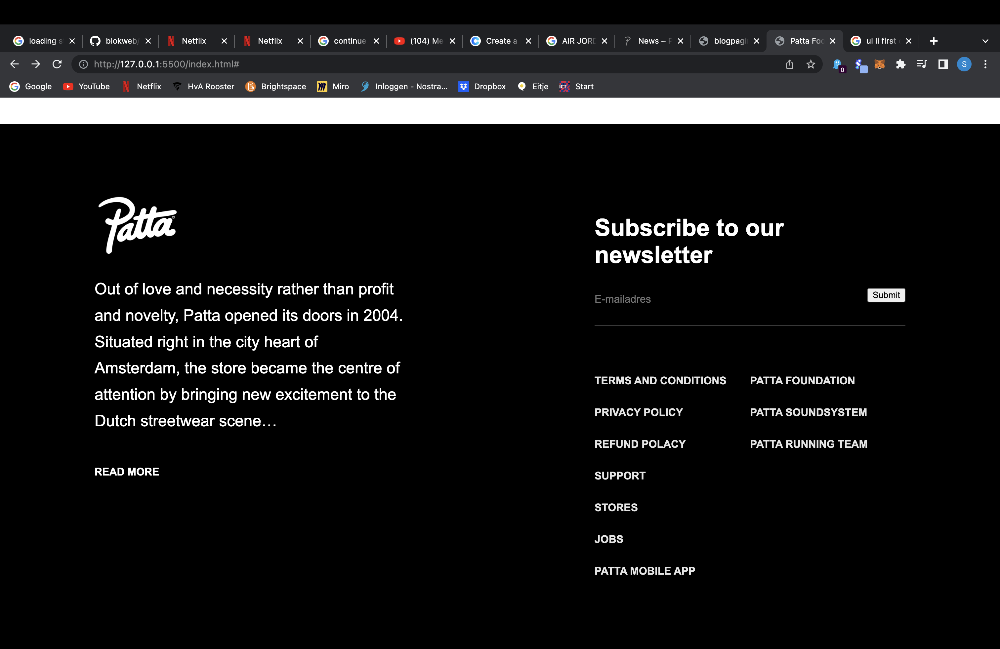
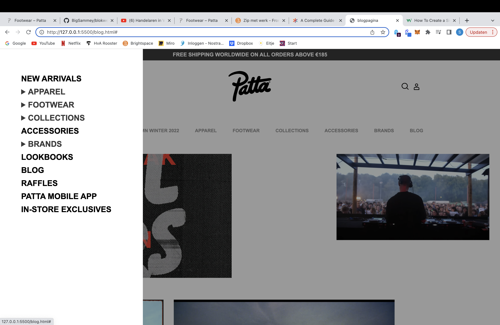

# Procesverslag
Markdown is een simpele manier om HTML te schrijven.  
Markdown cheat cheet: [Hulp bij het schrijven van Markdown](https://github.com/adam-p/markdown-here/wiki/Markdown-Cheatsheet).

Nb. De standaardstructuur en de spartaanse opmaak van de README.md zijn helemaal prima. Het gaat om de inhoud van je procesverslag. Besteedt de tijd voor pracht en praal aan je website.

Nb. Door *open* toe te voegen aan een *details* element kun je deze standaard open zetten. Fijn om dat steeds voor de relevante stuk(ken) te doen.

## Jij

  
uitwerken voor kick-off werkgroep

  ### Auteur:
  Sam Groot

  #### Je startniveau:
  Rood

  #### Je focus:
  Responsive
 

## Je website

  
uitwerken voor kick-off werkgroep

  ### Je opdracht:
  Ik ga de website van Patta gebruiken, dit is de link naar de site: https://www.patta.nl/nl

  #### Screenshot(s) van de eerste pagina (small screen): 
  De footwear pagina van de Patta site
  

  #### Screenshot(s) van de tweede pagina (small screen):
  De blogpagina van de Patta site
  
 

## Toegankelijkheidstest 1/2 (week 1)

  
uitwerken na test in 1e werkgroep

  ### Bevindingen
  Lijst met je bevindingen die in de test naar voren kwamen:

  #### Screenreader
  Hier korte omschrijving (met indien nodig afbeeldingen)
  - De screenreader werkt op de site van PATTA. De screenreader pakt alleen niet alle links, van de NAV-overlay pakt hij niet de links die subcategoriën bevatten. De link van het winkelwagentje pakt hij ook niet. 
  - De website bevat ook een navigatiebalk, als je erover heen hovert klapt er een venster uit en dit is niet mogelijk met de screenreader. 

  Hier een omschrijving van hoe het opgelost kan worden (met indien nodig afbeeldingen)
  - Het probleem met de nav-overlay kan gefixt worden door simpelweg een nieuwe nav-overlay te bouwen met daarin links als subcategoriën ipv 'A' tags. 
  - Het oplossen van de vensters die zich in de navigatiebalk verschuilen weet ik niet precies. 

  #### Muis en Toetsenbord 
  Hier korte omschrijving (met indien nodig afbeeldingen)
  - Door middel van de Tab toets kan je door de website navigeren. Het werkt prima maar ik ben erachter gekomen dat je toch echt een muis nodig hebt om een maat van een shirt, of schoen te kunnen selecteren. Ik heb dus geprobeerd om een artikel te bestellen en het is dus dmv de tab key + pijltjes alleen mogelijk om een XS te bestellen. 

  Hier een omschrijving van hoe het opgelost kan worden (met indien nodig afbeeldingen)
  - Ik denk ook hierbij dat nieuwe links een oplossing kunnen zijn voor de 'A' tags die niet gepakt worden. 

  #### Motoriek (shocks, elastiekjes)
  Hier korte omschrijving (met indien nodig afbeeldingen)
  - Elastiekjes: Met de elastiekjes om de vingers voelt het minder prettig om door de website te navigeren. Dit is puur omdat je dit niet gewend bent maar ik geloof dat het voor mensen die een beperking hebben echt wel te doen is om door de website te navigeren. Dit kan door middel van de screenreader of door de TAB-key. 

  - Shocks: Het schok apparaat is ook om gedaan en hiermee is ook gebruik gemaakt van de website. Heel eerlijk werkte het niet perce heel chill maar het was wel te doen. Ik geloof dat het sowieso niet heel goed werkt voor mensen die deze beperking hebben om gebruik te maken van websites maar ik denk dat een soort van interactieve website een mooie oplossing is voor dit probleem. Een soort robot die je de opdracht kan geven om een artikel te bestellen en die dan samen met jou alle stappen doorloopt. Natuurlijk niet echt realistisch om te maken maar misschien voor in de toekomst. 
  

  #### Visueel (brillen, contrast, kleurenblind, dark/light). 
  Hier korte omschrijving (met indien nodig afbeeldingen)
  - Slechtziend: De website beschikt over veel afbeeldingen dus dit betekend voor slechtzienden dat zij niet alle afbeeldingen goed kunnen zien. Erg jammer aangezien je wel een duidelijk beeld wilt krijgen van de producten en andere kleding die Patta verkoopt. 

  - Kleurenblind: Nogmaals, de website is erg visueel en dit betekend dat het voor gebruikers die kleurenblind zijn vervelend is om te zien uit welke kleuren de producten bestaan. Echter staan de kleuren wel op de detailpagina van de producten. 

  - Doof: Voor doven is het niet perse een probleem aangezien de website niet beschikt over veel video’s of muziek en dergelijke. De website is nogmaals erg visueel en dit zou dus niet perse een belemmering moeten zijn voor gebruikers die doof zijn. 

  Hier een omschrijving van hoe het opgelost kan worden (met indien nodig afbeeldingen)
  - Slechtziend: Een oplossing voor de afbeeldingen zou kunnen zijn dat het product wordt beschreven door middel van woorden in een ALT tag. Hierdoor kan de slechtziende gebruiker door middel van screenreader een beeld krijgen van het product waar de gebruiker op dat moment op staat. 

## Breakdownschets (week 1)

  
uitwerken na afloop 2e werkgroep

  ### de hele pagina: 
  

  ### dynamisch deel (bijv menu): 
  

  ### wellicht nog een dynamisch deel (bijv filter): 
  

## Voortgang 1 (week 2)

  
uitwerken voor 1e voortgang

  ### Stand van zaken
  Ik had de HTML van de eerste pagina gemaakt en heb dit vervolgens doorgenomen met een studentassistent. We hebben er samen rustig naar gekeken en eigenlijk was het best prima. Er waren een paar kleine dingetjes die even vervangen moesten worden zoals een span die omgezet moest worden naar een article. Dit was het eigenlijk. Ik heb niet meer dan dit besproken omdat ik er eigenlijk wel een positief gevoel over had en ook omdat ik niet meer vragen had. 

  ### Verslag van meeting
  hier na afloop snel de uitkomsten van de meeting vastleggen

  - Minder tot geen spans/divs gebruiken.
  - Door gaan op de manier hoe ik nu bezig ben. 

## Toegankelijkheidstest 2/2 (week 4)

  
uitwerken na test in 8e werkgroep

  ### Bevindingen
  Lijst met je bevindingen die in de test naar voren kwamen (geef ook aan wat er verbeterd is):

  #### Screenreader
  Hier korte omschrijving (met indien nodig afbeeldingen)
  - De screenreader werkte gelukkig om mijn versie van de website. De afbeeldingen en andere elementen waren goed begrijpbaar dmv de ALT. Het is een beetje weinig tekst wat ik hier typ maar het verliep simpelweg gewoon goed. 

  #### Muis en Toetsenbord 
  Hier korte omschrijving (met indien nodig afbeeldingen)
  - Valentijn en ik kwamen erachter dat de NAV-overlay lastig werd gepakt. Als je dmv de tab-key door de website navigeert dan is het focus balkje opeens uit het scherm. Dit komt dus omdat hij dan gefocust is op de nav-overlay. 

  Hier een omschrijving van hoe het opgelost kan worden (met indien nodig afbeeldingen)
  - Ik weet niet precies hoe dit opgelost kan worden maar ik denk dat ik hier even met Robert naar zal moeten kijken. 

## Voortgang 3 (week 4)

  
uitwerken voor 3e voortgang

  ### Stand van zaken
  Het opnieuw maken van de NAV-overlay is iets wat vrij lastig ging en waar ik best veel tijd aan kwijt was. Uiteindelijk is het wel gelukt en dit is niet gegaan zonder slag of stoot. 

  ### Verslag van meeting
  hier na afloop snel de uitkomsten van de meeting vastleggen

  - Door gaan hoe ik nu bezig ben. 
  - Gebruik masonry grid voor de blog pagina. 
  - Let erop dat je de pagina ook responsive maakt

## Eindgesprek (week 5)

  
uitwerken voor eindgesprek

  ### Je uitkomst - karakteristiek screenshots:
  
  
  

  ### Dit ging goed/Heb ik geleerd: 
  Korte omschrijving met plaatjes

  
  

  ### Dit was lastig/Is niet gelukt:
  De hover over de blogpagina foto's. De bedoeling hiervan is dat de H3 op de afbeelding tevoorschijn komt bij het hoveren. 

  

## Bronnenlijst

  
continu bijhouden terwijl je werkt

  Nb. Wees specifiek ('css-tricks' als bron is bijv. niet specifiek genoeg).

  1. https://css-tricks.com/snippets/css/a-guide-to-flexbox/
  2. https://www.youtube.com/watch?v=KrPz_wmBsAE
  3. https://www.w3schools.com/howto/howto_js_sidenav.asp

